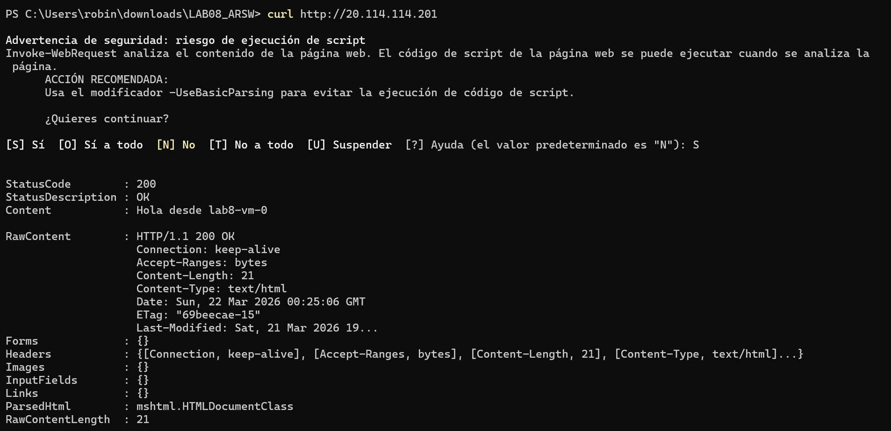
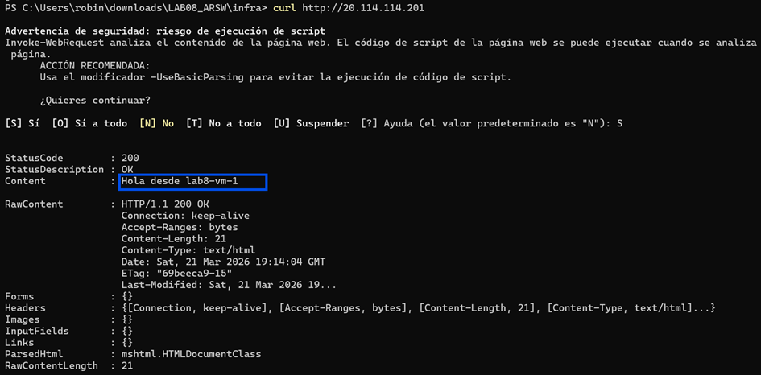
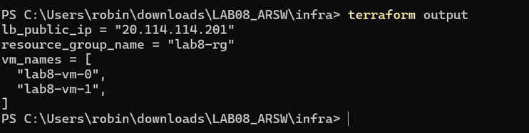
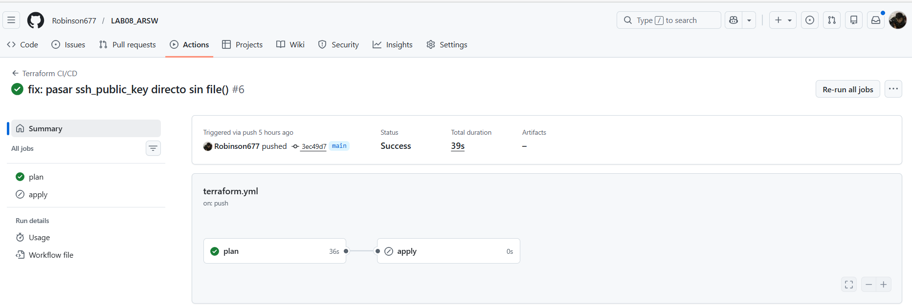
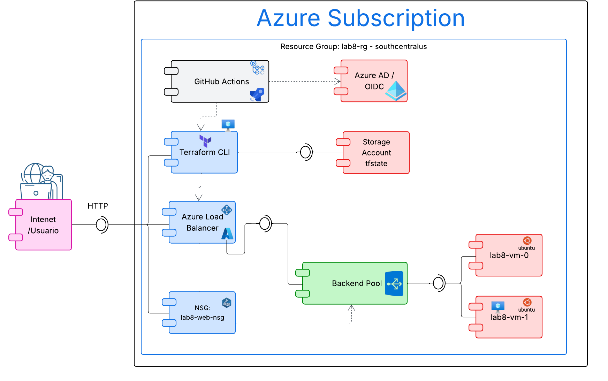
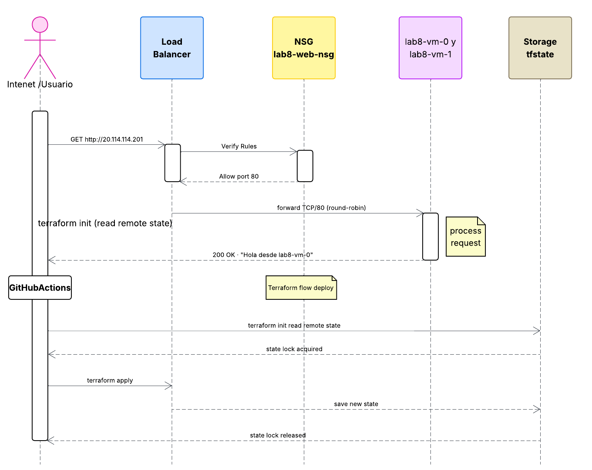
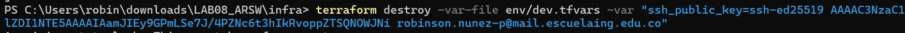
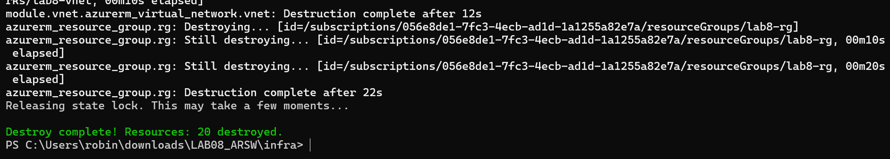

#  🧪 Lab #8 — Infraestructura como Código con Terraform (Azure) ☁️
📚 **Curso:** BluePrints / ARSW  
⏱️ **Duración estimada:** 2–3 horas (base) + 1–2 horas (retos)  
🗓️ **Última actualización:** 2025-11-09

---

## 👨‍💻 Developers

- 👨‍💻 **Juan Pablo Caballero**
- 👨‍💻 **Robinson Steven Nuñez**

---

## 🎯 Propósito
Modernizar el laboratorio de balanceo de carga en Azure usando **Terraform** para definir, aprovisionar y versionar la infraestructura. El objetivo es que los estudiantes diseñen y desplieguen una arquitectura reproducible, segura y con buenas prácticas de _IaC_.

## 🎓 Objetivos de aprendizaje
1. Modelar infraestructura de Azure con Terraform (providers, state, módulos y variables).
2. Desplegar una arquitectura de **alta disponibilidad** con **Load Balancer** (L4) y 2+ VMs Linux.
3. Endurecer mínimamente la seguridad: **NSG**, **SSH por clave**, **tags**, _naming conventions_.
4. Integrar **backend remoto** para el _state_ en Azure Storage con _state locking_.
5. Automatizar _plan_/**apply** desde **GitHub Actions** con autenticación OIDC (sin secretos largos).
6. Validar operación (health probe, página de prueba), observar costos y destruir con seguridad.

> **⚠️Nota:** Este lab reemplaza la versión clásica basada en acciones manuales. Enfócate en _IaC_ y _pipelines_.

---

##  🏛️ Arquitectura objetivo
- **Resource Group** (p. ej. `rg-lab8-<alias>`)
- **Virtual Network** con 2 subredes:
  - `subnet-web`: VMs detrás de **Azure Load Balancer (público)**
  - `subnet-mgmt`: Bastion o salto (opcional)
- **Network Security Group**: solo permite **80/TCP** (HTTP) desde Internet al LB y **22/TCP** (SSH) solo desde tu IP pública.
- **Load Balancer** público:
  - Frontend IP pública
  - Backend pool con 2+ VMs
  - **Health probe** (TCP/80 o HTTP)
  - **Load balancing rule** (80 → 80)
- **2+ VMs Linux** (Ubuntu LTS) con cloud-init/Custom Script Extension para instalar **nginx** y servir una página con el **hostname**.
- **Azure Storage Account + Container** para Terraform **remote state** (con bloqueo).
- **Etiquetas (tags)**: `owner`, `course`, `env`, `expires`.

> **🚀Opcional** (retos): usar **VM Scale Set**, o reemplazar LB por **Application Gateway** (L7).

---

## 📋 Requisitos previos
- Cuenta/Subscription en Azure (Azure for Students o equivalente).
- **Azure CLI** (`az`) y **Terraform >= 1.6** instalados en tu equipo.
- **SSH key** generada (ej. `ssh-keygen -t ed25519`).
- Cuenta en **GitHub** para ejecutar el pipeline de Actions.

---

## 📁 Estructura del repositorio (sugerida)
```
.
├─ infra/
│  ├─ main.tf
│  ├─ providers.tf
│  ├─ variables.tf
│  ├─ outputs.tf
│  ├─ backend.hcl.example
│  ├─ cloud-init.yaml
│  └─ env/
│     ├─ dev.tfvars
│     └─ prod.tfvars (opcional)
├─ modules/
│  ├─ vnet/
│  │  ├─ main.tf
│  │  ├─ variables.tf
│  │  └─ outputs.tf
│  ├─ compute/
│  │  ├─ main.tf
│  │  ├─ variables.tf
│  │  └─ outputs.tf
│  └─ lb/
│     ├─ main.tf
│     ├─ variables.tf
│     └─ outputs.tf
└─ .github/workflows/terraform.yml
```

---

## ⚙️ Bootstrap del backend remoto
Primero crea el **Resource Group**, **Storage Account** y **Container** para el _state_:

```bash
# Nombres únicos
SUFFIX=$RANDOM
LOCATION=eastus
RG=rg-tfstate-lab8
STO=sttfstate${SUFFIX}
CONTAINER=tfstate

az group create -n $RG -l $LOCATION
az storage account create -g $RG -n $STO -l $LOCATION --sku Standard_LRS --encryption-services blob
az storage container create --name $CONTAINER --account-name $STO
```

Completa `infra/backend.hcl.example` con los valores creados y renómbralo a `backend.hcl`.

---

## 🧩 Variables principales (ejemplo)
En `infra/variables.tf` define:
- `prefix`, `location`, `vm_count`, `admin_username`, `ssh_public_key`
- `allow_ssh_from_cidr` (tu IPv4 en /32)
- `tags` (map)

En `infra/env/dev.tfvars`:
```hcl
prefix        = "lab8"
location      = "eastus"
vm_count      = 2
admin_username= "student"
ssh_public_key= "~/.ssh/id_ed25519.pub"
allow_ssh_from_cidr = "X.X.X.X/32" # TU IP
tags = { owner = "tu-alias", course = "ARSW/BluePrints", env = "dev", expires = "2025-12-31" }
```

---

## ⚙️ cloud-init de las VMs
Archivo `infra/cloud-init.yaml` (instala nginx y muestra el hostname):
```yaml
#cloud-config
package_update: true
packages:
  - nginx
runcmd:
  - echo "Hola desde $(hostname)" > /var/www/html/index.nginx-debian.html
  - systemctl enable nginx
  - systemctl restart nginx
```

---

## 🚀 Flujo de trabajo local
```bash
cd infra

# Autenticación en Azure
az login
az account show # verifica la suscripción activa

# Inicializa Terraform con backend remoto
terraform init -backend-config=backend.hcl

# Revisión rápida
terraform fmt -recursive
terraform validate

# Plan con variables de dev
terraform plan -var-file=env/dev.tfvars -out plan.tfplan

# Apply
terraform apply "plan.tfplan"

# Verifica el LB público (cambia por tu IP)
curl http://$(terraform output -raw lb_public_ip)
```

**Outputs esperados** (ejemplo):
- `lb_public_ip`
- `resource_group_name`
- `vm_names`

---

## 🤖 GitHub Actions (CI/CD con OIDC)
El _workflow_ `.github/workflows/terraform.yml`:
- Ejecuta `fmt`, `validate` y `plan` en cada PR.
- Publica el plan como artefacto/comentario.
- Job manual `apply` con _workflow_dispatch_ y aprobación.

**Configura OIDC** en Azure (federación con tu repositorio) y asigna el rol **Contributor** al _principal_ del _workflow_ sobre el RG del lab.

---


## 📦 Entregables en TEAMS
1. **Repositorio GitHub** del equipo con:
   - Código Terraform (módulos) y `cloud-init.yaml`.
   - `backend.hcl` **(sin secretos)** y `env/dev.tfvars` (sin llaves privadas).
   - Workflow de GitHub Actions y evidencias del `plan`.
2. **Diagrama** (componente y secuencia) del caso de estudio propuesto.
3. **URL/IP pública** del Load Balancer + **captura** mostrando respuesta de **2 VMs** (p. ej. refrescar y ver hostnames cambiar).
4. **Reflexión técnica** (1 página máx.): decisiones, trade‑offs, costos aproximados y cómo destruir seguro.
5. **Limpieza**: confirmar `terraform destroy` al finalizar.

---

# Solución:

**Nota:** Aquí se encuentran las evidencias de los entregables 1 y 3 paso a paso. Para ver explicaciones detalladas consultar el documento LAB08_ARSW.pdf: 

## 📸 Evidencias rápidas

> Para el paso a paso completo ver [LAB08_ARSW.pdf](./docs/LAB08_ARSW.pdf)


### URL del Load Balancer:
http://20.114.114.201

### Load Balancer respondiendo — lab8-vm-0


### Load Balancer respondiendo — lab8-vm-1


### Outputs de Terraform


### GitHub Actions — pipeline en verde


---

## Diagramas UML:

### Diagrama de Componentes:




### Diagrama de Secuencia:



Link: https://lucid.app/lucidchart/4d43fa30-5c28-4e00-8e36-475817e41fbe/edit?viewport_loc=-2551%2C-991%2C2615%2C1219%2C0_0&invitationId=inv_e1e7a0f6-62a5-442d-9f1c-eaf2429514c1

---

## Reflexión técnica:
[Ver en PDF documento de reflexion técnica](./docs/Reflexion.pdf)

---


## 📊 Rúbrica (100 pts)
- **Infra desplegada y funcional (40 pts):** LB, 2+ VMs, health probe, NSG correcto.
- **Buenas prácticas Terraform (20 pts):** módulos, variables, `fmt/validate`, _remote state_.
- **Seguridad y costos (15 pts):** SSH por clave, NSG mínimo, tags y _naming_; estimación de costos.
- **CI/CD (15 pts):** pipeline con `plan` automático y `apply` manual (OIDC).
- **Documentación y diagramas (10 pts):** README del equipo, diagramas claros y reflexión.

---

## 🎯 Retos (elige 2+)
- Migrar a **VM Scale Set** con _Custom Script Extension_ o **cloud-init**.
- Reemplazar LB por **Application Gateway** con _probe_ HTTP y _path-based routing_ (si exponen múltiples apps).
- **Azure Bastion** para acceso SSH sin IP pública en VMs.
- **Alertas** de Azure Monitor (p. ej. estado del probe) y **Budget alert**.
- **Módulos privados** versionados con _semantic versioning_.

---

## Retos elegidos:
1. **Alertas de Azure Monitor** (Budget alert + Monitor Metric Alert sobre el health probe)
2. **Módulos privados versionados con semantic versioning** (versions.tf + tag v1.0.0)

[Ver en documento PDF los 2 retos realizados](./docs/retos.pdf)

---

## 🧹 Limpieza
```bash
terraform destroy -var-file=env/dev.tfvars
```

> **Tip:** Mantén los recursos etiquetados con `expires` y **elimina** todo al terminar.

---

## Hacemos el Destroy 






---

## 🤔 Preguntas de reflexión
- ¿Por qué L4 LB vs Application Gateway (L7) en tu caso? ¿Qué cambiaría?

**RTA:** Se eligió L4 porque el lab expone un único servicio HTTP sin necesidad de enrutamiento por paths ni SSL. El LB L4 es más económico (~$18/mes vs ~$50/mes del App Gateway) y tiene menor latencia al no inspeccionar el contenido HTTP. Con Application Gateway cambiaría: se podría tener path-based routing (/app1, /app2), terminación HTTPS centralizada y WAF integrado.

- ¿Qué implicaciones de seguridad tiene exponer 22/TCP? ¿Cómo mitigarlas?

**RTA:** Exponer SSH directamente a Internet permite ataques de fuerza bruta y escaneo de puertos. En el lab se mitigó restringiendo el acceso a una IP específica /32 en el NSG. Para mitigarlo correctamente en producción: usar Azure Bastion acceso SSH sin IP pública en las VMs, deshabilitar el puerto 22 en el NSG, o usar Just-in-Time VM Access de Microsoft Defender.


- ¿Qué mejoras harías si esto fuera **producción**? (resiliencia, autoscaling, observabilidad).

**RTA:**
  - **Resiliencia:** VM Scale Sets con autoscaling para escalar según carga y reemplazar VMs caídas automáticamente.
  - **Autoscaling:** reglas basadas en CPU o métricas del LB para escalar entre 2 y 10 instancias.
  - **Observabilidad:** Azure Monitor con dashboards de latencia, Log Analytics Workspace para centralizar logs de nginx, y alertas de disponibilidad.
  - **Seguridad:** Azure Bastion, certificado TLS en Application Gateway, y Key Vault para secretos.

---

## 📚 Créditos y material de referencia
- Azure, Terraform, IaC, LB y VMSS (docs oficiales) — revisa enlaces en clase.
